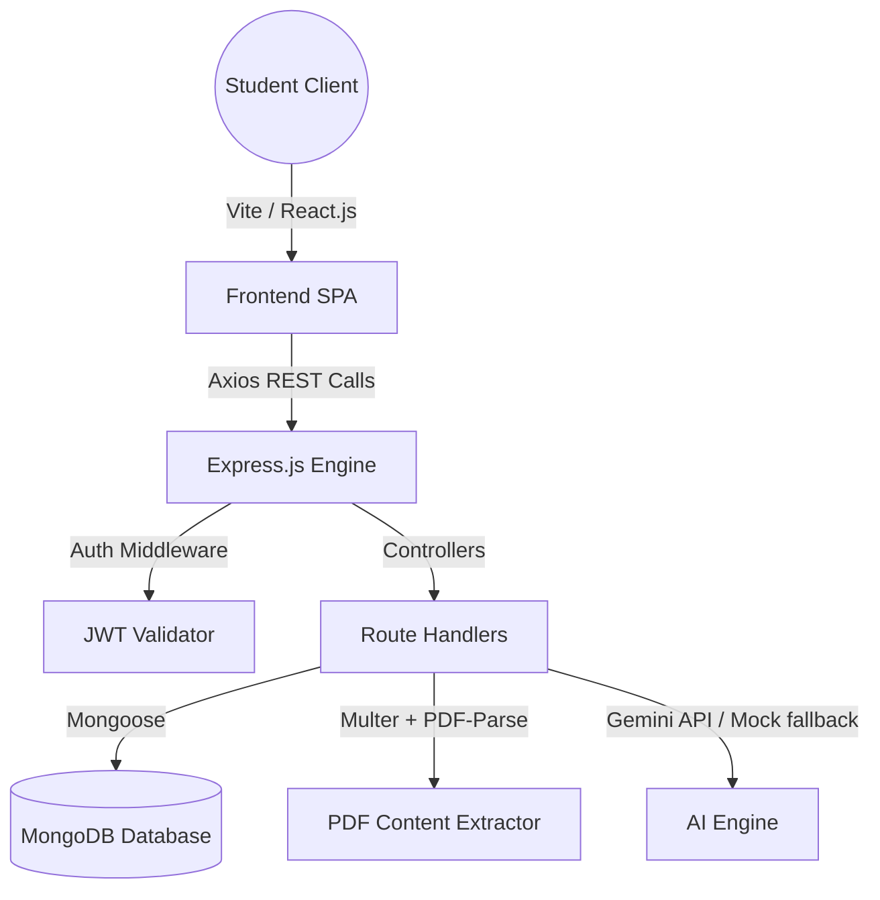

# EduAI – AI-Powered Learning & Interview Preparation Assistant

EduAI is a professional, production-grade MERN Stack web application designed to help engineering students prepare for coding challenges, technical assessments, behavioral rounds, and ATS resume screenings.

---

## 🛠️ Technology Stack & Architecture

EduAI is structured using a clean MVC (Model-View-Controller) architecture separated into a decoupled Frontend SPA and a backend REST API.



### Frontend Architecture
- **React.js & React Router**: For Single Page routing and guards.
- **Tailwind CSS & Custom CSS**: Class-based Dark Mode theme, custom scrollbars, glassmorphism cards, and glowing accent rings.
- **Recharts**: Responsive charts showing mock score trends, problem languages, and category distributions.
- **Lucide Icons**: Fluid iconography.

### Backend Architecture
- **Node.js & Express.js**: REST API server.
- **MongoDB & Mongoose**: Schemas mapping user streak analytics, bookmarks, notes, mock interview histories, and coding submissions.
- **JWT & bcryptjs**: Safe session tokens and hashed password comparisons.
- **Multer & PDF-Parse**: Extractor reading PDF resume uploads directly into memory buffers.
- **Gemini Pro (Google GenAI)**: Powers tutor explanations and grading. Seemlessly falls back to an offline rule-based processor if the API key is not present.

---

## 🚀 Getting Started

### Prerequisites
- Node.js installed (v18+ recommended)
- MongoDB running locally (`mongodb://127.0.0.1:27017`) or a MongoDB Atlas connection string.

### Configuration (`.env`)
Create a `.env` file in the `backend/` directory (or use the preconfigured one):
```env
PORT=5000
MONGO_URI=mongodb://127.0.0.1:27017/eduai
JWT_SECRET=eduai_jwt_secret_key_12345
GEMINI_API_KEY=your_gemini_api_key_here
NODE_ENV=development
```

### Installation
1. Install backend and frontend dependencies:
   ```bash
   # In root directory
   cd backend
   npm install
   
   cd ../frontend
   npm install
   ```

2. Seed the database with sample CSE Student history and Admin data:
   ```bash
   cd ../backend
   node seed.js
   ```

3. Launch backend and frontend local servers:
   ```bash
   # Start Backend (in backend/)
   npm start
   
   # Start Frontend (in frontend/)
   npm run dev
   ```

4. Open `http://localhost:3000` in your browser.

---

## 🔑 Seeding Credentials
Use these preseeded credentials to test the application immediately:
- **Student Profile**:
  - Email: `student@eduai.com`
  - Password: `studentpassword`
- **Admin Dashboard**:
  - Email: `admin@eduai.com`
  - Password: `adminpassword`

---

## 📈 Key Features Checklist

- [x] **JWT Auth & Streak Tracking**: Register, login, update profile, and track daily activity.
- [x] **AI Tutor Assistant**: Consult code explanations, beginner-friendly analogies, or interview Q&A.
- [x] **Technical Quizzes**: Get dynamic technical assessments with inline explanations.
- [x] **ATS Resume Analyzer**: Upload PDF files, scan content, measure ATS score, identify missing skills, and suggest projects.
- [x] **Voice-Activated Mock Interviews**: Speak answers via Web Speech API or type text. Get overall grades, communication assessments, and Q&A audits.
- [x] **Personalized Learning Roadmaps**: Interactive timeline path checks showing MERN, DSA, and Placement trackers.
- [x] **Sandboxed Coding Platform**: Select difficulty filters, read problems, request hints, and execute JavaScript inside a Node `vm` sandbox.
- [x] **Admin Analytics Console**: Manage accounts, promote permissions, and monitor system trends via Pie/Bar charts.

---

## 📄 Resume Description (ATS-Optimized)

Add this descriptive bullet block to your resume to showcase this project:

> **EduAI – AI-Powered Learning & Placement Preparation Assistant**
> * *Technologies used*: MongoDB, Express.js, React.js, Node.js, JWT, Multer, Recharts, pdf-parse, Google Gemini API
> * Engineered a full-stack MERN placement preparation assistant utilizing a decoupled client-server REST architecture.
> * Implemented an automated ATS Resume Analyzer using `multer` memory storage and `pdf-parse` to extract layout text, scoring CVs and returning project suggestions to resolve identified skills gaps.
> * Developed a voice-activated Mock Interview platform employing the Web Speech API for real-time answer transcription, tracking response times, and outputting multi-dimensional grading reports (Confidence, Clarity, Technical Accuracy).
> * Formulated a sandboxed JS compiler using Node's `vm` module with timeout execution loops, validation checks, and automatic user analytics updates.

---

## 💬 Interview Q&A Preparation (Recruiter-Ready)

#### Q1: Why did you use Multer memory storage instead of disk storage for resume uploads?
**A**: "Since we only need to read the resume text once to perform the ATS analysis, writing files to the disk would create unnecessary local storage overhead, requires cleaning cron jobs, and poses security concerns regarding persistent malicious file executions. Memory storage loads the PDF buffer straight into RAM, executes the text parser, and immediately garbage collects the buffer once the request completes."

#### Q2: How did you implement code execution safely on the backend?
**A**: "To run JavaScript code safely, we used Node's built-in `vm` module to run the code in a new, isolated context. We guarded against CPU freezing issues (like infinite loops) by adding a strict `timeout: 1000` execution limit. In a production-level enterprise environment, I would isolate this further inside a containerized sandbox or AWS Lambda function to prevent access to the host server's resources."

#### Q3: How did you handle speech recognition on the frontend?
**A**: "I utilized the browser's native Web Speech API (`window.webkitSpeechRecognition`). When recording starts, the audio is processed and transcribed by the browser in real-time. If the browser doesn't support the API, the system automatically switches to a traditional text area fallback so the mock session remains fully operational."

#### Q4: How is the learning streak logic calculated?
**A**: "Whenever a user signs in, the backend compares the current date with the `lastActiveDate` saved in the database. If the difference is exactly 1 day, the streak increments by 1. If it is greater than 1 day, the streak resets to 1. Finally, the system updates the `lastActiveDate` to the current timestamp."
